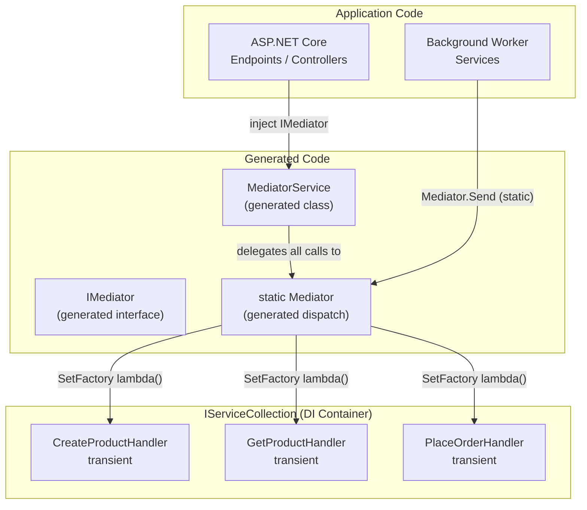

# Dependency Injection

By default, ZeroAlloc.Mediator instantiates handlers via their parameterless constructor. For handlers that depend on services — repositories, loggers, HTTP clients — you have three options: factory delegates via `Mediator.Configure()`, full DI container integration via `IMediator`/`MediatorService`, or the static `Mediator` class on hot paths where the `IMediator` interface overhead isn't wanted.

## Migrating from v1.x

In v2.0 the Mediator family adopted a fluent builder pattern. Old extensions remain as `[Obsolete]` shims for one minor version.

| v1.x | v2.x |
|---|---|
| `services.AddSingleton<IMediator, MediatorService>()` | `services.AddMediator()` (returns `IMediatorBuilder`) |
| `services.AddMediatorCache()` | `services.AddMediator().WithCache()` |
| `services.AddMediatorValidation()` | `services.AddMediator().WithValidation()` |
| `services.AddMediatorResilience()` | `services.AddMediator().WithResilience()` |

Diagnostic IDs `ZAMED001` / `ZAMED002` / `ZAMED003` mark the deprecated bridge entry points.

The static `Mediator.Send(...)` / `Mediator.Publish(...)` API is unaffected. Static-API users do not need to call `AddMediator()`.

## Option 1 — Factory Delegates (Mediator.Configure)

Best for: console apps, worker services, small APIs, or anywhere you want DI without a container.

```csharp
// At startup, before any Mediator.Send calls
Mediator.Configure(config =>
{
    var repo = new ProductRepository(connectionString);
    config.SetFactory(() => new CreateProductHandler(repo));
    config.SetFactory(() => new GetProductHandler(repo));
    config.SetFactory(() => new ArchiveProductHandler(repo));
    // One SetFactory call per handler type that has dependencies
});
```

The factory delegate is called each time a handler is needed. Use a shared singleton dependency (like `repo` above) for stateless services, or create a new instance per call for stateful ones.

## Option 2 — Full DI Container (ASP.NET Core)

Best for: ASP.NET Core applications using `IServiceCollection`.

### Registration

```csharp
// Program.cs
var builder = WebApplication.CreateBuilder(args);

// Register your handlers
builder.Services.AddTransient<CreateProductHandler>();
builder.Services.AddTransient<GetProductHandler>();
builder.Services.AddTransient<ArchiveProductHandler>();
builder.Services.AddTransient<PlaceOrderHandler>();
builder.Services.AddTransient<GetOrderHandler>();

// Register IMediator backed by MediatorService.
// services.AddMediator() is generated by ZeroAlloc.Mediator.Generator and registers
// IMediator -> MediatorService as a singleton. It returns an IMediatorBuilder for
// chaining bridge-package registrations such as .WithCache(), .WithValidation(),
// .WithResilience(), or .WithTelemetry() (when those packages are referenced).
builder.Services.AddMediator();

// Wire up handler factories so the generated MediatorService can resolve them via DI.
Mediator.Configure(config =>
{
    var sp = builder.Services.BuildServiceProvider();
    config.SetFactory(() => sp.GetRequiredService<CreateProductHandler>());
    config.SetFactory(() => sp.GetRequiredService<GetProductHandler>());
    config.SetFactory(() => sp.GetRequiredService<ArchiveProductHandler>());
    config.SetFactory(() => sp.GetRequiredService<PlaceOrderHandler>());
    config.SetFactory(() => sp.GetRequiredService<GetOrderHandler>());
});
```

### Using IMediator in Minimal API Endpoints

```csharp
var app = builder.Build();

app.MapPost("/products", async (
    CreateProductRequest req,
    IMediator mediator,
    CancellationToken ct) =>
{
    var id = await mediator.Send(
        new CreateProductCommand(req.Name, req.Sku, req.Price, req.StockLevel), ct);
    return Results.Created($"/products/{id.Value}", id);
});

app.MapGet("/products/{id:guid}", async (
    Guid id,
    IMediator mediator,
    CancellationToken ct) =>
{
    try
    {
        var dto = await mediator.Send(new GetProductQuery(id), ct);
        return Results.Ok(dto);
    }
    catch (ProductNotFoundException)
    {
        return Results.NotFound();
    }
});
```

### Using IMediator in a Controller

```csharp
[ApiController]
[Route("api/orders")]
public class OrdersController : ControllerBase
{
    private readonly IMediator _mediator;

    public OrdersController(IMediator mediator) => _mediator = mediator;

    [HttpPost]
    public async Task<IActionResult> PlaceOrder(PlaceOrderRequest req, CancellationToken ct)
    {
        var id = await _mediator.Send(
            new PlaceOrderCommand(req.CustomerId, req.Items), ct);
        return CreatedAtAction(nameof(GetOrder), new { id = id.Value }, id);
    }

    [HttpGet("{id:guid}")]
    public async Task<IActionResult> GetOrder(Guid id, CancellationToken ct)
    {
        var order = await _mediator.Send(new GetOrderQuery(id), ct);
        return Ok(order);
    }
}
```

## Option 3 — Static Mediator (No DI)

Best for: background services, high-performance loops, Native AOT, or any path where even interface dispatch overhead matters.

```csharp
// Worker service — no IMediator injection needed
public class OrderProcessingWorker : BackgroundService
{
    protected override async Task ExecuteAsync(CancellationToken ct)
    {
        await foreach (var message in _queue.ReadAllAsync(ct))
        {
            var command = new PlaceOrderCommand(message.CustomerId, message.Items);
            var orderId = await Mediator.Send(command, ct);  // static, zero overhead
            await _queue.AckAsync(message.Id, ct);
        }
    }
}
```

Factories still apply — call `Mediator.Configure` at startup. The static class uses the same factory delegates as `IMediator`.

## DI Architecture Diagram



## Scoped vs Transient vs Singleton Handlers

| Lifetime | Use when | Example |
|----------|----------|---------|
| `Transient` | Handler uses `DbContext` or other scoped services | Most handlers with EF Core |
| `Scoped` | Handler needs to share state within a request | Custom unit-of-work pattern |
| `Singleton` | Handler is stateless and has no scoped dependencies | Pure in-memory handlers |

Important: `DbContext` must never be `Singleton`. Use `Transient` or `Scoped` for any handler that touches EF Core.

## Common Pitfalls

**Pitfall 1 — Forgetting to call `Mediator.Configure` before first request**

If a handler has constructor parameters but no factory is registered, the generator falls back to `new THandler()` — which throws `MissingMethodException`. Call `Mediator.Configure` during app startup, before the app starts serving requests.

**Pitfall 2 — Singleton handler capturing scoped `DbContext`**

```csharp
// ❌ DbContext is scoped; storing it in a singleton handler causes issues
builder.Services.AddSingleton<CreateProductHandler>();

// ✅ Use transient
builder.Services.AddTransient<CreateProductHandler>();
```

**Pitfall 3 — `MediatorService` and static `Mediator` both need `Configure`**

`MediatorService.Send` delegates to `static Mediator.Send`. They share the same factory registry. You only need to call `Mediator.Configure` once.

**Pitfall 4 — Testing with mocked `IMediator`**

If you're testing code that takes `IMediator`, you can mock it with any mocking library. But for testing the actual handler logic, test the handler directly — don't go through `Mediator.Send`. See [Testing](testing.md).

## Bridge Packages

The `IMediatorBuilder` returned by `AddMediator()` is the entry point that bridge packages (`ZeroAlloc.Mediator.Cache`, `.Validation`, `.Resilience`, future `.Telemetry`) extend with `WithXxx()` helpers:

```csharp
services.AddMediator()
        .WithCache()        // ZeroAlloc.Mediator.Cache 2.x
        .WithValidation()   // ZeroAlloc.Mediator.Validation 2.x
        .WithResilience();  // ZeroAlloc.Mediator.Resilience 2.x
```

`AddMediator()` is idempotent (`TryAddSingleton`); calling it more than once is safe. The static `Mediator.Send(...)` / `Mediator.Publish(...)` API and the `Mediator.Configure(...)` factory registry are unchanged.
