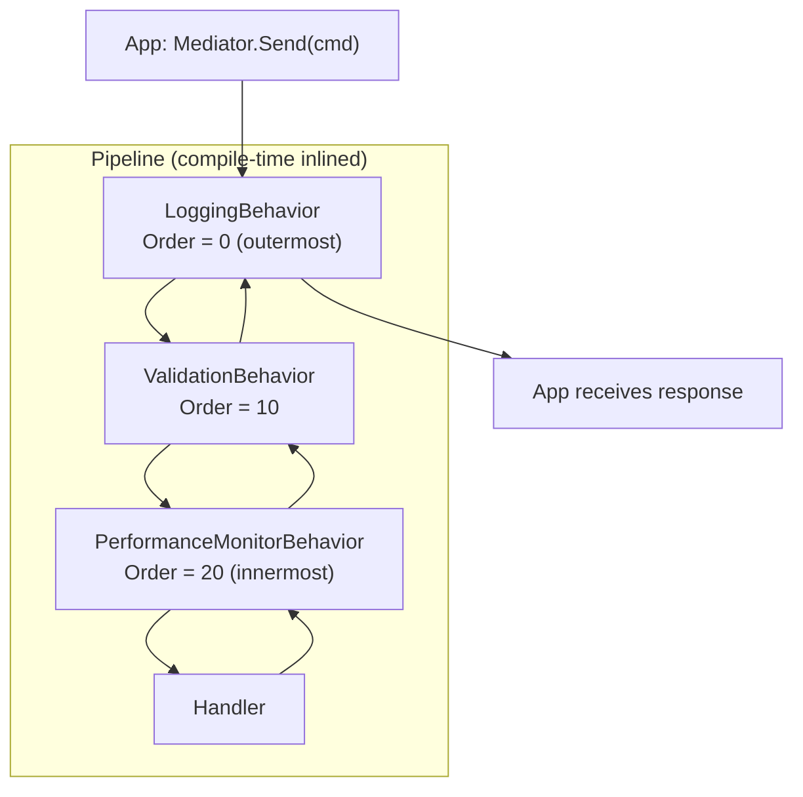

# Pipeline Behaviors

Pipeline behaviors are middleware that wrap every request dispatch. They are the right place for cross-cutting concerns: logging, validation, performance monitoring, caching, and transactions. Unlike MediatR's `IPipelineBehavior<TRequest, TResponse>`, ZeroAlloc.Mediator inlines behaviors at compile time as nested static lambdas — no interface allocation, no virtual dispatch, zero overhead.

## Anatomy of a Pipeline Behavior

```csharp
using System.Diagnostics;
using ZeroAlloc.Mediator;

[PipelineBehavior(Order = 0)]
public sealed class LoggingBehavior : IPipelineBehavior
{
    public static async ValueTask<TResponse> Handle<TRequest, TResponse>(
        TRequest request,
        CancellationToken ct,
        Func<TRequest, CancellationToken, ValueTask<TResponse>> next)
    {
        var name = typeof(TRequest).Name;
        var sw = Stopwatch.StartNew();
        Console.WriteLine($"[START] {name}");
        try
        {
            var response = await next(request, ct);
            Console.WriteLine($"[END] {name} completed in {sw.ElapsedMilliseconds}ms");
            return response;
        }
        catch (Exception ex)
        {
            Console.WriteLine($"[FAIL] {name} failed after {sw.ElapsedMilliseconds}ms: {ex.Message}");
            throw;
        }
    }
}
```

- `: IPipelineBehavior` — required; the generator only picks up a `[PipelineBehavior]` class that implements it. A `static class` cannot implement an interface, so a static behavior never runs; either mistake is reported as ZAM009 (see [Pitfall 1](#common-pitfalls))
- `sealed class` — the generator never creates an instance; it calls the static `Handle` directly. `sealed` is a convention, not a requirement
- `public static Handle` — required; a missing or non-static `Handle` is reported as ZAM005
- `[PipelineBehavior(Order = 0)]` — a lower Order runs further out: first to run, last to complete. 0 is the default; the bridge packages use negative orders, so they wrap your behaviors (see [Behaviors from Referenced Assemblies](#behaviors-from-referenced-assemblies))
- `Handle<TRequest, TResponse>` — generic; applies to ALL request types globally
- `next(request, ct)` — calls the next behavior, or the final handler if this is the innermost behavior
- Must `await next(...)` and return the result — forgetting this silently drops the response

## Ordering Multiple Behaviors

```csharp
[PipelineBehavior(Order = 0)]
public sealed class LoggingBehavior : IPipelineBehavior { ... }             // outermost — runs before all, completes after all

[PipelineBehavior(Order = 10)]
public sealed class ValidationBehavior : IPipelineBehavior { ... }          // middle

[PipelineBehavior(Order = 20)]
public sealed class PerformanceMonitorBehavior : IPipelineBehavior { ... }  // innermost — closest to handler
```

Execution order on the way IN (before handler): Logging → Validation → PerformanceMonitor → Handler

Execution order on the way OUT (after handler): Handler → PerformanceMonitor → Validation → Logging

Convention: use gaps of 10 between Order values so you can insert new behaviors later without renumbering.



## Scoped Behaviors with AppliesTo

Use `AppliesTo` to target a behavior at exactly one request type. Other requests skip it entirely.

```csharp
[PipelineBehavior(Order = 5, AppliesTo = typeof(PlaceOrderCommand))]
public sealed class OrderStockValidationBehavior : IPipelineBehavior
{
    public static async ValueTask<TResponse> Handle<TRequest, TResponse>(
        TRequest request,
        CancellationToken ct,
        Func<TRequest, CancellationToken, ValueTask<TResponse>> next)
    {
        if (request is PlaceOrderCommand cmd)
        {
            foreach (var item in cmd.Items)
            {
                if (item.Quantity <= 0)
                    throw new InvalidOperationException($"Quantity for {item.Sku} must be positive.");
            }
        }

        return await next(request, ct);
    }
}
```

Note: `AppliesTo` accepts a concrete request type, not an interface. The generator uses this to only include the behavior in the dispatch chain for that specific type.

## Practical Example — Exception Handling Behavior

```csharp
[PipelineBehavior(Order = 0)]
public sealed class ExceptionHandlingBehavior : IPipelineBehavior
{
    public static async ValueTask<TResponse> Handle<TRequest, TResponse>(
        TRequest request,
        CancellationToken ct,
        Func<TRequest, CancellationToken, ValueTask<TResponse>> next)
    {
        try
        {
            return await next(request, ct);
        }
        catch (NotFoundException ex)
        {
            // Re-throw as a domain-friendly exception
            throw new DomainException($"Resource not found: {ex.Message}", ex);
        }
        catch (OperationCanceledException) when (ct.IsCancellationRequested)
        {
            // Let cancellation propagate naturally
            throw;
        }
        catch (Exception ex)
        {
            // Log and re-throw unexpected exceptions
            Console.Error.WriteLine($"Unhandled exception in {typeof(TRequest).Name}: {ex}");
            throw;
        }
    }
}
```

## Behaviors from Referenced Assemblies

The generator also inlines behaviors that live in assemblies your project references. That is how the bridge packages plug in: referencing `ZeroAlloc.Mediator.Cache` puts `CacheBehavior` into the pipeline of every request, and `WithCache()` supplies the `IMemoryCache` it needs at run time. A request without `[CacheResponse]` passes straight through it.

A referenced type joins the pipeline when it is a public, non-generic class that implements `ZeroAlloc.Mediator.IPipelineBehavior`, carries `[PipelineBehavior]`, and has a public static `Handle<TRequest, TResponse>`. An `internal` behavior stays private to its own assembly, so make a behavior internal when a library should not export it.

The bridge behaviors use fixed orders with gaps between them, all below your own behaviors' default of 0:

| Order | Behavior | Why here |
|---|---|---|
| -3000 | `TelemetryBehavior` | Outermost, so its metrics cover everything below it |
| -1000 | `AuthorizationBehavior` | A denied caller reaches nothing else |
| -750 | `ValidationBehavior` | Only authorized requests are validated |
| -500 | `CacheBehavior` | Only valid requests are answered from the cache |
| -250 | `ResilienceBehavior` | A cache hit skips the retries; a retry repeats only your behaviors and the handler |

Give your own behavior an order between two of these to run it there. ZAM006 reports an order that ties with a referenced behavior, as it does for two of your own.

## How Inlining Works (Conceptual)

Instead of building a `List<IPipelineBehavior>` at runtime and iterating it, the generator emits code like:

```csharp
// Conceptual — what the generator emits for PlaceOrderCommand with 3 behaviors
public static ValueTask<OrderId> Send(PlaceOrderCommand request, CancellationToken ct = default)
    => LoggingBehavior.Handle(request, ct, (req, token) =>
        ValidationBehavior.Handle(req, token, (req2, token2) =>
            OrderStockValidationBehavior.Handle(req2, token2, (req3, token3) =>
                (_placeOrderHandlerFactory?.Invoke() ?? new PlaceOrderHandler()).Handle(req3, token3))));
```

Zero allocation. No list. No delegates stored on the heap. No virtual calls.

## Common Pitfalls

**Pitfall 1 — Static class, or no `IPipelineBehavior` (ZAM009)**

```csharp
// ❌ Never runs, ZAM009 — a static class cannot implement IPipelineBehavior, so the generator skips it
[PipelineBehavior(Order = 0)]
public static class LoggingBehavior { ... }

// ❌ Never runs, ZAM009 — the class does not implement IPipelineBehavior
[PipelineBehavior(Order = 0)]
public sealed class LoggingBehavior { ... }

// ✅ Correct — a non-static class that implements IPipelineBehavior, with a static Handle
[PipelineBehavior(Order = 0)]
public sealed class LoggingBehavior : IPipelineBehavior { ... }
```

The generated `Send` has no call to either behavior, and each is reported as the warning [ZAM009](diagnostics.md#zam009--pipeline-behavior-does-not-implement-ipipelinebehavior). Only `Handle` is static; the class itself must not be. A behavior that implements `IPipelineBehavior` but has no `public static Handle<TRequest, TResponse>` is reported as [ZAM005](diagnostics.md#zam005--pipeline-behavior-missing-handle-method).

**Pitfall 2 — Forgetting to call `next`**

```csharp
// ❌ Response is lost — handler never called
public static async ValueTask<TResponse> Handle<TRequest, TResponse>(
    TRequest request, CancellationToken ct,
    Func<TRequest, CancellationToken, ValueTask<TResponse>> next)
{
    Console.WriteLine("Before");
    // forgot: return await next(request, ct);
    return default!;
}
```

**Pitfall 3 — Duplicate Order values (ZAM006)**

```csharp
// ❌ Both Order=10 — execution order is non-deterministic
[PipelineBehavior(Order = 10)]
public sealed class ValidationBehavior : IPipelineBehavior { ... }

[PipelineBehavior(Order = 10)]
public sealed class CachingBehavior : IPipelineBehavior { ... }

// ✅ Use unique values with gaps
[PipelineBehavior(Order = 10)]
public sealed class ValidationBehavior : IPipelineBehavior { ... }

[PipelineBehavior(Order = 20)]
public sealed class CachingBehavior : IPipelineBehavior { ... }
```

**Pitfall 4 — Accessing DI services from a behavior**

`Handle` is static and the generator never creates the behavior class, so a behavior has no instance state and no constructor injection. To access services (e.g., `ILogger`, `DbContext`), use an ambient scope pattern. See [Dependency Injection](dependency-injection.md) and the [Transactional Pipeline cookbook](cookbook/04-transactional-pipeline.md).
