# ZeroAlloc.Mediator Documentation Implementation Plan

> **For Claude:** REQUIRED SUB-SKILL: Use superpowers:executing-plans to implement this plan task-by-task.

**Goal:** Write 14 consumer-facing documentation files for `ZeroAlloc.Mediator` covering all features with real-world examples and Mermaid diagrams.

**Architecture:** Two sections — `docs/` for feature reference docs (numbered 01–08) and `docs/cookbook/` for scenario-driven recipes (01–06). Each file stands alone but cross-links to related docs.

**Tech Stack:** Markdown, Mermaid diagrams, C# 12, .NET 8/10, ZeroAlloc.Mediator 0.1.x

---

## Context: Library Primer

`ZeroAlloc.Mediator` is a zero-allocation mediator for .NET. Key facts the plan executor must know:

- Requests use `readonly record struct` (not classes) for zero allocation
- The `Mediator` static class (`Send`, `Publish`, `CreateStream`) is generated at compile time by a Roslyn source generator
- `IMediator` + `MediatorService` are generated for DI scenarios
- `[PipelineBehavior(Order = N)]` attribute marks middleware; `AppliesTo` scopes it to one request type
- `[ParallelNotification]` on a notification type dispatches all its handlers concurrently via `Task.WhenAll`
- Polymorphic handlers: a handler for `IOrderNotification` automatically handles all types implementing that interface
- Diagnostics ZAM001–ZAM007 are compile-time errors/warnings
- Namespace: `ZeroAlloc.Mediator`
- NuGet: `ZeroAlloc.Mediator`

---

## Conventions for All Docs

- Domain: e-commerce (orders, users, products, inventory) — no toy Ping/Pong examples
- Every file starts with a one-paragraph summary
- Every file has at least one Mermaid diagram
- "Common pitfalls" section at the bottom of feature docs
- Cross-links: `[Pipeline Behaviors](../05-pipeline-behaviors.md)` style
- Code blocks use ` ```csharp ` fences

---

### Task 1: `docs/01-getting-started.md`

**Files:**
- Create: `docs/01-getting-started.md`

**Step 1: Write the file**

Content outline (write ALL of this in full prose and code):

```
# Getting Started

One-paragraph intro: what ZeroAlloc.Mediator is and why it exists (zero-alloc, compile-time dispatch, AOT).

## Installation

```bash
dotnet add package ZeroAlloc.Mediator
```

Note: no extra setup needed — the source generator runs automatically on build.

## Your First Request

Real-world scenario: placing an order. Show the full flow in 4 steps.

### Step 1 — Define the request

```csharp
using ZeroAlloc.Mediator;

public readonly record struct PlaceOrderCommand(
    string CustomerId,
    IReadOnlyList<OrderLineItem> Items
) : IRequest<OrderId>;

public readonly record struct OrderId(Guid Value);
public readonly record struct OrderLineItem(string Sku, int Quantity, decimal UnitPrice);
```

### Step 2 — Implement the handler

```csharp
public class PlaceOrderHandler : IRequestHandler<PlaceOrderCommand, OrderId>
{
    public ValueTask<OrderId> Handle(PlaceOrderCommand command, CancellationToken ct)
    {
        // Business logic here
        var id = new OrderId(Guid.NewGuid());
        return ValueTask.FromResult(id);
    }
}
```

### Step 3 — Send the request

```csharp
var command = new PlaceOrderCommand("customer-42", [
    new OrderLineItem("SKU-001", 2, 29.99m)
]);

OrderId orderId = await Mediator.Send(command);
Console.WriteLine($"Order placed: {orderId.Value}");
```

### Step 4 — Build

Build the project. The source generator emits the `Mediator.Send` overload for `PlaceOrderCommand` automatically.

## Mermaid diagram

Show the flow from user code → Mediator.Send (generated) → PlaceOrderHandler → response.

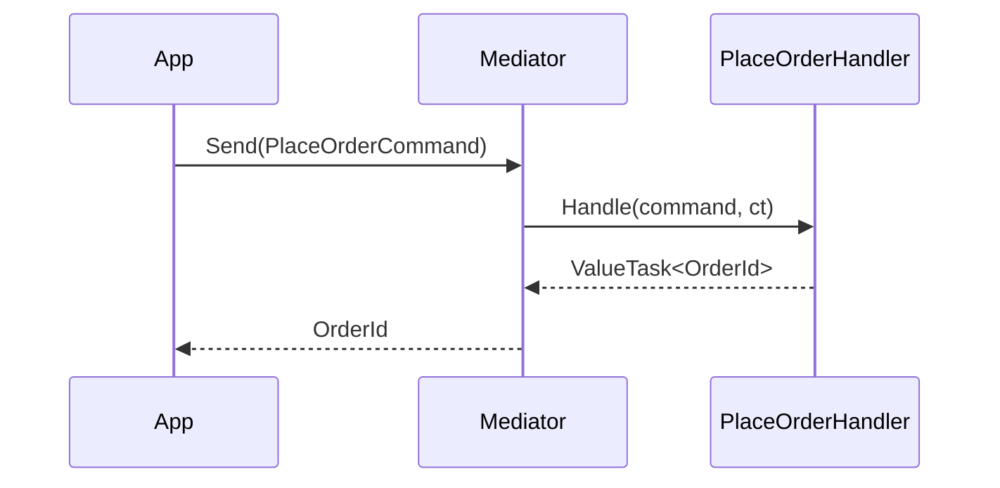

## What's Generated

Show a snippet of the generated code (as illustration, not verbatim):

```csharp
// Auto-generated by ZeroAlloc.Mediator.Generator
public static partial class Mediator
{
    public static ValueTask<OrderId> Send(
        PlaceOrderCommand request, CancellationToken ct = default)
        => (_placeOrderHandlerFactory?.Invoke() ?? new PlaceOrderHandler())
               .Handle(request, ct);
}
```

## Next Steps

Bullet list linking to:
- [Requests & Handlers](02-requests.md)
- [Notifications](03-notifications.md)
- [Streaming](04-streaming.md)
- [Pipeline Behaviors](05-pipeline-behaviors.md)
- [Dependency Injection](06-dependency-injection.md)
```

**Step 2: Verify**

Read the file back and confirm:
- [ ] Has Mermaid diagram
- [ ] No Ping/Pong examples
- [ ] Has working `csharp` code blocks
- [ ] Has "Next Steps" section linking to other docs

**Step 3: Commit**

```bash
git add docs/01-getting-started.md
git commit -m "docs: add getting started guide"
```

---

### Task 2: `docs/02-requests.md`

**Files:**
- Create: `docs/02-requests.md`

**Step 1: Write the file**

Content outline:

```
# Requests & Handlers

Intro paragraph: requests are the primary unit of work; CQRS means commands mutate state and return an ID/acknowledgement; queries read state and return data.

## IRequest<TResponse> — Requests with a Return Value

Show both a command and a query pattern.

### Command example

```csharp
public readonly record struct CreateProductCommand(
    string Name,
    string Sku,
    decimal Price,
    int StockLevel
) : IRequest<ProductId>;

public readonly record struct ProductId(Guid Value);

public class CreateProductHandler : IRequestHandler<CreateProductCommand, ProductId>
{
    private readonly IProductRepository _repo;

    public CreateProductHandler(IProductRepository repo) => _repo = repo;

    public async ValueTask<ProductId> Handle(CreateProductCommand cmd, CancellationToken ct)
    {
        var product = new Product(cmd.Name, cmd.Sku, cmd.Price, cmd.StockLevel);
        await _repo.SaveAsync(product, ct);
        return new ProductId(product.Id);
    }
}
```

### Query example

```csharp
public readonly record struct GetProductQuery(Guid ProductId) : IRequest<ProductDto>;

public readonly record struct ProductDto(Guid Id, string Name, string Sku, decimal Price);

public class GetProductHandler : IRequestHandler<GetProductQuery, ProductDto>
{
    private readonly IProductRepository _repo;

    public GetProductHandler(IProductRepository repo) => _repo = repo;

    public async ValueTask<ProductDto> Handle(GetProductQuery query, CancellationToken ct)
    {
        var product = await _repo.FindAsync(query.ProductId, ct)
            ?? throw new ProductNotFoundException(query.ProductId);

        return new ProductDto(product.Id, product.Name, product.Sku, product.Price);
    }
}
```

## IRequest — Fire-and-Forget (Unit)

Explain `IRequest` is shorthand for `IRequest<Unit>`. Use for commands that don't need to return data.

```csharp
public readonly record struct ArchiveOrderCommand(Guid OrderId) : IRequest;

public class ArchiveOrderHandler : IRequestHandler<ArchiveOrderCommand, Unit>
{
    public async ValueTask<Unit> Handle(ArchiveOrderCommand cmd, CancellationToken ct)
    {
        // archive logic...
        return Unit.Value;
    }
}

// Calling it:
await Mediator.Send(new ArchiveOrderCommand(orderId));
```

## Dispatching

```csharp
// With cancellation
using var cts = new CancellationTokenSource(TimeSpan.FromSeconds(5));

var productId = await Mediator.Send(
    new CreateProductCommand("Widget", "WGT-001", 9.99m, 100),
    cts.Token);
```

## Mermaid diagram — CQRS dispatch flow

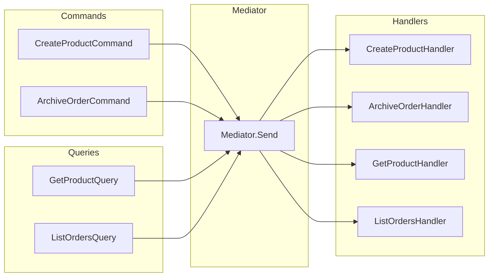

## Rules & Best Practices

- Requests MUST be `readonly record struct` (not classes). Using a class triggers diagnostic ZAM003.
- One handler per request type. Multiple handlers = compile error ZAM002.
- No handler = compile error ZAM001.
- Keep requests as pure data — no behaviour, no services.

## Common Pitfalls

Pitfall 1: Using a class for the request type → ZAM003 warning, boxing occurs.
Pitfall 2: Handler constructor has dependencies → must use DI or Mediator.Configure(). See [Dependency Injection](06-dependency-injection.md).
Pitfall 3: Forgetting to return Unit.Value in fire-and-forget handlers.
```

**Step 2: Verify**

- [ ] Has Mermaid flowchart
- [ ] Shows both command and query patterns
- [ ] Explains Unit
- [ ] Has "Common Pitfalls" section

**Step 3: Commit**

```bash
git add docs/02-requests.md
git commit -m "docs: add requests and handlers guide"
```

---

### Task 3: `docs/03-notifications.md`

**Files:**
- Create: `docs/03-notifications.md`

**Step 1: Write the file**

Content outline:

```
# Notifications

Intro: notifications (events) decouple the sender from reactions. One event → zero or more handlers. Three flavors: sequential, parallel, polymorphic.

## Sequential Notifications (default)

Scenario: when an order ships, send an email AND update inventory.

```csharp
public readonly record struct OrderShippedEvent(
    Guid OrderId,
    string TrackingNumber,
    DateTimeOffset ShippedAt
) : INotification;

public class SendShipmentEmailHandler : INotificationHandler<OrderShippedEvent>
{
    private readonly IEmailService _email;
    public SendShipmentEmailHandler(IEmailService email) => _email = email;

    public async ValueTask Handle(OrderShippedEvent evt, CancellationToken ct)
        => await _email.SendShipmentConfirmationAsync(evt.OrderId, evt.TrackingNumber, ct);
}

public class UpdateInventoryHandler : INotificationHandler<OrderShippedEvent>
{
    private readonly IInventoryService _inventory;
    public UpdateInventoryHandler(IInventoryService inventory) => _inventory = inventory;

    public ValueTask Handle(OrderShippedEvent evt, CancellationToken ct)
    {
        _inventory.RecordShipment(evt.OrderId);
        return ValueTask.CompletedTask;
    }
}
```

Publishing:
```csharp
await Mediator.Publish(new OrderShippedEvent(orderId, "1Z999AA10123456784", DateTimeOffset.UtcNow));
```

Sequential means: SendShipmentEmailHandler runs fully, THEN UpdateInventoryHandler runs.

## Parallel Notifications

Use `[ParallelNotification]` when handlers are independent and you want them to run concurrently.

```csharp
[ParallelNotification]
public readonly record struct PaymentReceivedEvent(
    Guid OrderId,
    decimal Amount,
    string PaymentMethod
) : INotification;

public class SendReceiptHandler : INotificationHandler<PaymentReceivedEvent>
{
    public async ValueTask Handle(PaymentReceivedEvent evt, CancellationToken ct)
        => await _email.SendReceiptAsync(evt.OrderId, evt.Amount, ct);
}

public class UpdateLedgerHandler : INotificationHandler<PaymentReceivedEvent>
{
    public async ValueTask Handle(PaymentReceivedEvent evt, CancellationToken ct)
        => await _ledger.RecordPaymentAsync(evt.OrderId, evt.Amount, ct);
}

public class TriggerFulfillmentHandler : INotificationHandler<PaymentReceivedEvent>
{
    public async ValueTask Handle(PaymentReceivedEvent evt, CancellationToken ct)
        => await _fulfillment.StartAsync(evt.OrderId, ct);
}
```

Generated code uses `Task.WhenAll` — all three handlers run concurrently.

## Polymorphic Handlers

A handler for a base type/interface automatically handles all derived types.

```csharp
// Base marker interface
public interface IOrderLifecycleEvent : INotification
{
    Guid OrderId { get; }
}

// Concrete events
public readonly record struct OrderCreatedEvent(Guid OrderId, string CustomerId)
    : IOrderLifecycleEvent;

public readonly record struct OrderCancelledEvent(Guid OrderId, string Reason)
    : IOrderLifecycleEvent;

// Handler for ALL IOrderLifecycleEvent types
public class OrderAuditLogger : INotificationHandler<IOrderLifecycleEvent>
{
    private readonly IAuditLog _audit;
    public OrderAuditLogger(IAuditLog audit) => _audit = audit;

    public ValueTask Handle(IOrderLifecycleEvent evt, CancellationToken ct)
    {
        _audit.Log($"Order {evt.OrderId} lifecycle event: {evt.GetType().Name}");
        return ValueTask.CompletedTask;
    }
}

// Handler for ALL INotification types (global handler)
public class GlobalEventTracer : INotificationHandler<INotification>
{
    public ValueTask Handle(INotification evt, CancellationToken ct)
    {
        Trace.WriteLine($"[EVENT] {evt.GetType().Name}");
        return ValueTask.CompletedTask;
    }
}
```

When `OrderCreatedEvent` is published:
1. `OrderAuditLogger` runs (handles `IOrderLifecycleEvent`)
2. `GlobalEventTracer` runs (handles `INotification`)
3. Any `INotificationHandler<OrderCreatedEvent>` handler runs

## Mermaid diagrams

### Sequential dispatch
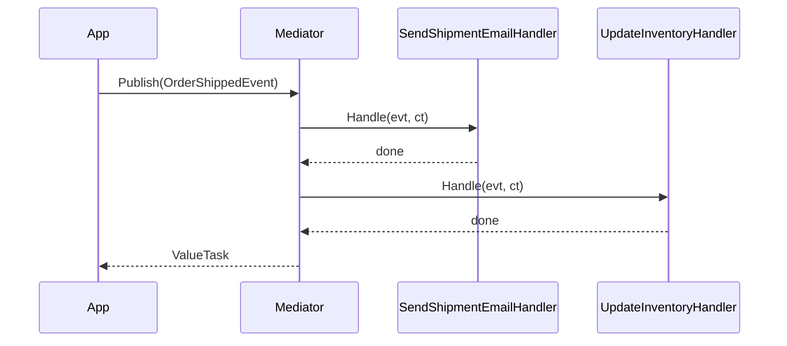

### Parallel dispatch
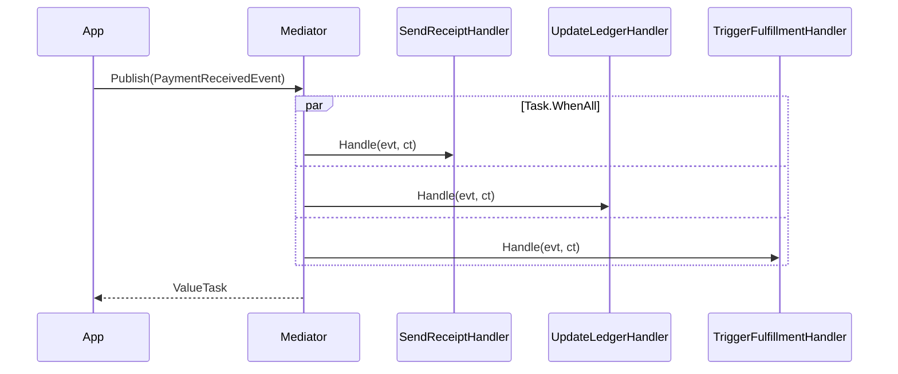

## Common Pitfalls

Pitfall 1: Using `[ParallelNotification]` when handlers share mutable state — use sequential for that.
Pitfall 2: Throwing in one parallel handler cancels others (Task.WhenAll aggregates exceptions).
Pitfall 3: Polymorphic handlers are included automatically by the generator — you don't need to register them separately.
```

**Step 2: Verify**

- [ ] Covers sequential, parallel, polymorphic
- [ ] Has 2 Mermaid diagrams
- [ ] Shows `[ParallelNotification]` attribute
- [ ] Has pitfalls

**Step 3: Commit**

```bash
git add docs/03-notifications.md
git commit -m "docs: add notifications guide"
```

---

### Task 4: `docs/04-streaming.md`

**Files:**
- Create: `docs/04-streaming.md`

**Step 1: Write the file**

Content outline:

```
# Streaming

Intro: streaming returns `IAsyncEnumerable<T>` — ideal for large result sets, real-time feeds, or any scenario where you want to process items as they arrive rather than waiting for the full result.

## Defining a Stream Request

Scenario: exporting all orders in a date range without loading everything into memory.

```csharp
public readonly record struct ExportOrdersQuery(
    DateTimeOffset From,
    DateTimeOffset To
) : IStreamRequest<OrderExportRow>;

public readonly record struct OrderExportRow(
    Guid OrderId,
    string CustomerId,
    decimal TotalAmount,
    DateTimeOffset PlacedAt
);
```

## Implementing the Handler

```csharp
public class ExportOrdersHandler : IStreamRequestHandler<ExportOrdersQuery, OrderExportRow>
{
    private readonly IOrderRepository _repo;

    public ExportOrdersHandler(IOrderRepository repo) => _repo = repo;

    public async IAsyncEnumerable<OrderExportRow> Handle(
        ExportOrdersQuery query,
        [EnumeratorCancellation] CancellationToken ct)
    {
        await foreach (var order in _repo.StreamByDateRangeAsync(query.From, query.To, ct))
        {
            yield return new OrderExportRow(
                order.Id,
                order.CustomerId,
                order.TotalAmount,
                order.PlacedAt);
        }
    }
}
```

## Consuming the Stream

```csharp
var query = new ExportOrdersQuery(
    DateTimeOffset.UtcNow.AddDays(-30),
    DateTimeOffset.UtcNow);

await foreach (var row in Mediator.CreateStream(query, ct))
{
    await csvWriter.WriteRowAsync(row, ct);
}
```

## Real-Time Feed Example

Scenario: tailing a live log stream.

```csharp
public readonly record struct TailLogQuery(string ServiceName) : IStreamRequest<LogEntry>;
public readonly record struct LogEntry(DateTimeOffset Timestamp, string Level, string Message);

public class TailLogHandler : IStreamRequestHandler<TailLogQuery, LogEntry>
{
    private readonly ILogStore _store;
    public TailLogHandler(ILogStore store) => _store = store;

    public async IAsyncEnumerable<LogEntry> Handle(
        TailLogQuery query,
        [EnumeratorCancellation] CancellationToken ct)
    {
        await foreach (var entry in _store.TailAsync(query.ServiceName, ct))
            yield return new LogEntry(entry.Timestamp, entry.Level, entry.Message);
    }
}

// Consumer:
using var cts = new CancellationTokenSource();
await foreach (var entry in Mediator.CreateStream(new TailLogQuery("api-gateway"), cts.Token))
    Console.WriteLine($"[{entry.Level}] {entry.Message}");
```

## Mermaid diagram

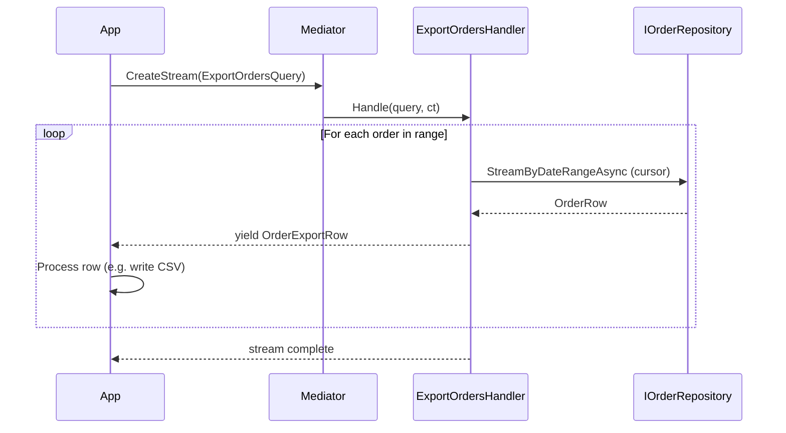

## Common Pitfalls

Pitfall 1: Forgetting `[EnumeratorCancellation]` on the CancellationToken parameter — cancellation won't propagate correctly.
Pitfall 2: Materialising the whole `IAsyncEnumerable` into a list inside the handler defeats the purpose.
Pitfall 3: Stream handlers must return `IAsyncEnumerable<TResponse>` exactly — returning `IEnumerable<T>` or `Task<IEnumerable<T>>` causes ZAM007.
```

**Step 2: Verify**

- [ ] Has Mermaid sequence diagram
- [ ] Has `[EnumeratorCancellation]` on handler
- [ ] Two real-world scenarios
- [ ] Pitfalls section

**Step 3: Commit**

```bash
git add docs/04-streaming.md
git commit -m "docs: add streaming guide"
```

---

### Task 5: `docs/05-pipeline-behaviors.md`

**Files:**
- Create: `docs/05-pipeline-behaviors.md`

**Step 1: Write the file**

Content outline:

```
# Pipeline Behaviors

Intro: pipeline behaviors are middleware that wrap every request dispatch. They are the right place for cross-cutting concerns like logging, validation, caching, and transactions. Unlike MediatR, ZeroAlloc.Mediator inlines behaviors at compile time — no interfaces to implement, no virtual dispatch.

## Anatomy of a Pipeline Behavior

```csharp
[PipelineBehavior(Order = 0)]
public static class LoggingBehavior
{
    public static async ValueTask<TResponse> Handle<TRequest, TResponse>(
        TRequest request,
        CancellationToken ct,
        Func<TRequest, CancellationToken, ValueTask<TResponse>> next)
    {
        var name = typeof(TRequest).Name;
        Console.WriteLine($"[START] {name}");
        var sw = Stopwatch.StartNew();
        try
        {
            var response = await next(request, ct);
            Console.WriteLine($"[END] {name} in {sw.ElapsedMilliseconds}ms");
            return response;
        }
        catch (Exception ex)
        {
            Console.WriteLine($"[FAIL] {name}: {ex.Message}");
            throw;
        }
    }
}
```

Key points:
- The class must be `static`
- The method must be `static` with exact signature: `ValueTask<TResponse> Handle<TRequest, TResponse>(TRequest, CancellationToken, Func<...>)`
- `[PipelineBehavior(Order = N)]` — lower Order runs outermost (first before, last after)

## Ordering Multiple Behaviors

Show three behaviors with order 0, 10, 20.

```csharp
[PipelineBehavior(Order = 0)]
public static class LoggingBehavior { ... }   // outermost

[PipelineBehavior(Order = 10)]
public static class ValidationBehavior { ... } // middle

[PipelineBehavior(Order = 20)]
public static class CachingBehavior { ... }    // innermost
```

Mermaid onion diagram showing nesting.

## Scoped Behaviors with AppliesTo

Use `AppliesTo` to target a behavior at one request type only.

```csharp
[PipelineBehavior(Order = 5, AppliesTo = typeof(PlaceOrderCommand))]
public static class OrderValidationBehavior
{
    public static async ValueTask<TResponse> Handle<TRequest, TResponse>(
        TRequest request,
        CancellationToken ct,
        Func<TRequest, CancellationToken, ValueTask<TResponse>> next)
    {
        if (request is PlaceOrderCommand cmd && cmd.Items.Count == 0)
            throw new InvalidOperationException("Order must have at least one item.");

        return await next(request, ct);
    }
}
```

## Practical Example — Validation Behavior

Full example integrating simple hand-rolled validation:

```csharp
[PipelineBehavior(Order = 10)]
public static class ValidationBehavior
{
    public static async ValueTask<TResponse> Handle<TRequest, TResponse>(
        TRequest request,
        CancellationToken ct,
        Func<TRequest, CancellationToken, ValueTask<TResponse>> next)
    {
        if (request is IValidatable validatable)
        {
            var errors = validatable.Validate();
            if (errors.Count > 0)
                throw new ValidationException(errors);
        }

        return await next(request, ct);
    }
}

public interface IValidatable
{
    IReadOnlyList<string> Validate();
}

public readonly record struct CreateProductCommand(string Name, string Sku, decimal Price)
    : IRequest<ProductId>, IValidatable
{
    public IReadOnlyList<string> Validate()
    {
        var errors = new List<string>();
        if (string.IsNullOrWhiteSpace(Name)) errors.Add("Name is required.");
        if (string.IsNullOrWhiteSpace(Sku))  errors.Add("Sku is required.");
        if (Price <= 0)                       errors.Add("Price must be positive.");
        return errors;
    }
}
```

## Mermaid diagram — pipeline nesting

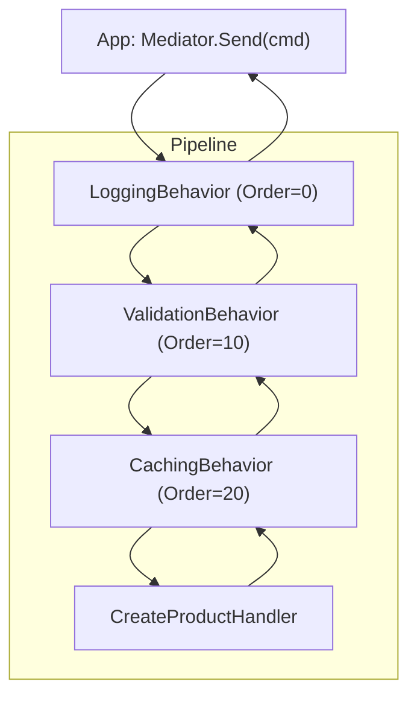

## Common Pitfalls

Pitfall 1: Behavior class is not `static` → diagnostic ZAM005.
Pitfall 2: Forgetting `await next(request, ct)` — request is silently swallowed.
Pitfall 3: Two behaviors with the same `Order` value → warning ZAM006 (behavior order becomes non-deterministic).
Pitfall 4: Using `AppliesTo` with an interface type — it must be an exact request type.
```

**Step 2: Verify**

- [ ] Has Mermaid pipeline flowchart
- [ ] Shows global + scoped behaviors
- [ ] Explains `Order` semantics clearly
- [ ] Has pitfalls

**Step 3: Commit**

```bash
git add docs/05-pipeline-behaviors.md
git commit -m "docs: add pipeline behaviors guide"
```

---

### Task 6: `docs/06-dependency-injection.md`

**Files:**
- Create: `docs/06-dependency-injection.md`

**Step 1: Write the file**

Content outline:

```
# Dependency Injection

Intro: by default, ZeroAlloc.Mediator creates handlers via their parameterless constructor. For handlers with dependencies, use either `Mediator.Configure()` with factory delegates, or the generated `IMediator`/`MediatorService` pair for full DI container integration.

## Option 1 — Factory Delegates (Mediator.Configure)

Best for: small apps, console apps, or when you want DI without a container.

```csharp
// At startup
Mediator.Configure(config =>
{
    config.SetFactory(() => new CreateProductHandler(new ProductRepository()));
    config.SetFactory(() => new GetProductHandler(new ProductRepository()));
    // ... one SetFactory call per handler type that has dependencies
});
```

Factory delegates are stored per handler type. The generator emits a `SetFactory<THandler>` method that validates the type at compile time.

## Option 2 — IMediator + MediatorService (Full DI)

Best for: ASP.NET Core applications, anywhere `IServiceCollection` is available.

### Registration

```csharp
// Program.cs
var builder = WebApplication.CreateBuilder(args);

// Register handlers as transient services
builder.Services.AddTransient<CreateProductHandler>();
builder.Services.AddTransient<GetProductHandler>();
builder.Services.AddTransient<PlaceOrderHandler>();
// ... all handlers

// Wire up factories and register IMediator
builder.Services.AddSingleton<IMediator, MediatorService>();
builder.Services.AddSingleton<IServiceProvider>(sp => sp);

// Tell Mediator to resolve handlers from the container
builder.Services.AddHostedService<MediatorConfigurator>();
```

```csharp
public class MediatorConfigurator : IHostedService
{
    private readonly IServiceProvider _sp;
    public MediatorConfigurator(IServiceProvider sp) => _sp = sp;

    public Task StartAsync(CancellationToken ct)
    {
        Mediator.Configure(config =>
        {
            config.SetFactory(() => _sp.GetRequiredService<CreateProductHandler>());
            config.SetFactory(() => _sp.GetRequiredService<GetProductHandler>());
            config.SetFactory(() => _sp.GetRequiredService<PlaceOrderHandler>());
        });
        return Task.CompletedTask;
    }

    public Task StopAsync(CancellationToken ct) => Task.CompletedTask;
}
```

### Using IMediator in Controllers / Endpoints

```csharp
app.MapPost("/products", async (CreateProductRequest req, IMediator mediator, CancellationToken ct) =>
{
    var command = new CreateProductCommand(req.Name, req.Sku, req.Price, req.StockLevel);
    var productId = await mediator.Send(command, ct);
    return Results.Created($"/products/{productId.Value}", productId);
});

app.MapGet("/products/{id:guid}", async (Guid id, IMediator mediator, CancellationToken ct) =>
{
    var dto = await mediator.Send(new GetProductQuery(id), ct);
    return Results.Ok(dto);
});
```

## Option 3 — Static Mediator (No DI)

Best for: high-performance paths, background services, or Native AOT where DI overhead matters.

```csharp
// Just call Mediator.Send directly — no interface, no allocation
var result = await Mediator.Send(new PlaceOrderCommand(...), ct);
```

Zero allocation, zero interface dispatch overhead. Trade-off: harder to mock in tests (use `Mediator.Configure` with test fakes instead).

## Mermaid diagram

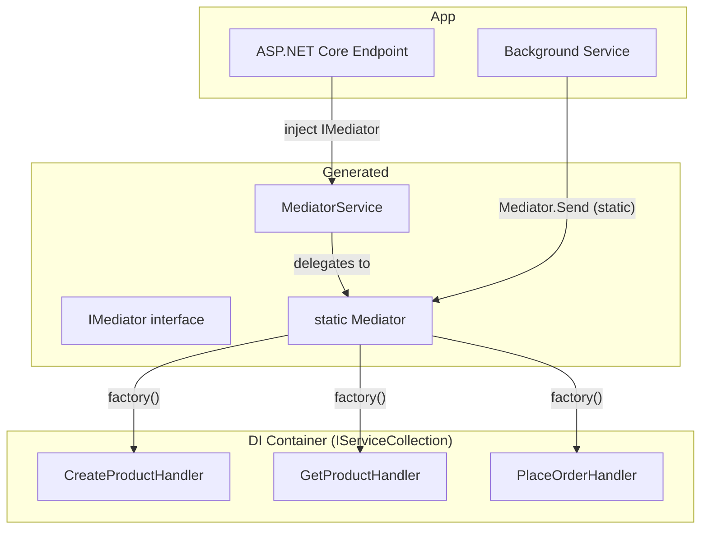

## Common Pitfalls

Pitfall 1: Forgetting to call `Mediator.Configure` before the first request — handler constructor with no parameterless constructor throws.
Pitfall 2: Registering handlers as `Singleton` when they hold scoped services (e.g., `DbContext`) — use `Transient` or `Scoped`.
Pitfall 3: `MediatorService` delegates to the static `Mediator` — calling both is fine, but `Configure` must be done once and applies to both.
```

**Step 2: Verify**

- [ ] Three DI options clearly differentiated
- [ ] ASP.NET Core Minimal API example
- [ ] Mermaid diagram
- [ ] Pitfalls

**Step 3: Commit**

```bash
git add docs/06-dependency-injection.md
git commit -m "docs: add dependency injection guide"
```

---

### Task 7: `docs/07-diagnostics.md`

**Files:**
- Create: `docs/07-diagnostics.md`

**Step 1: Write the file**

Content outline:

```
# Compiler Diagnostics

ZeroAlloc.Mediator validates your setup at compile time. Errors and warnings appear in your IDE and on `dotnet build`, not at runtime.

## Diagnostic Reference

Full table:

| Code | Severity | Title | Meaning |
|------|----------|-------|---------|
| ZAM001 | Error | No handler for request | A request type implements `IRequest<T>` but has no `IRequestHandler` |
| ZAM002 | Error | Multiple handlers for request | More than one handler found for the same request type |
| ZAM003 | Warning | Request type is a class | Request type should be `readonly record struct` for zero allocation |
| ZAM004 | Error | Invalid handler signature | Handler method signature doesn't match expected (enforced by compiler) |
| ZAM005 | Error | Pipeline behavior missing Handle method | A class with `[PipelineBehavior]` has no `Handle<TRequest, TResponse>` static method |
| ZAM006 | Warning | Duplicate pipeline behavior Order | Two behaviors share the same `Order` value; execution order is non-deterministic |
| ZAM007 | Error | Stream handler wrong return type | Stream handler must return `IAsyncEnumerable<TResponse>` |

## ZAM001 — No Handler Found

**Cause:** You defined `GetProductQuery : IRequest<ProductDto>` but no class implementing `IRequestHandler<GetProductQuery, ProductDto>` exists in the compilation.

**Fix:** Add the handler class to your project:

```csharp
public class GetProductHandler : IRequestHandler<GetProductQuery, ProductDto>
{
    public ValueTask<ProductDto> Handle(GetProductQuery query, CancellationToken ct)
        => /* ... */;
}
```

**Common trap:** Handler is in a different assembly that isn't referenced.

## ZAM002 — Multiple Handlers

**Cause:** Two classes both implement `IRequestHandler<PlaceOrderCommand, OrderId>`.

**Fix:** Remove or rename the duplicate. Only one concrete handler per request type is allowed.

## ZAM003 — Request Is a Class

**Cause:**
```csharp
public class GetProductQuery : IRequest<ProductDto> { ... }  // class, not struct
```

**Fix:**
```csharp
public readonly record struct GetProductQuery(Guid ProductId) : IRequest<ProductDto>;
```

Using a class causes boxing when passing to `ValueTask<TResponse>`, negating zero-allocation benefits.

## ZAM005 — Pipeline Behavior Missing Handle Method

**Cause:**
```csharp
[PipelineBehavior(Order = 0)]
public static class LoggingBehavior
{
    // forgot to add Handle method
}
```

**Fix:** Add the required static method:
```csharp
public static async ValueTask<TResponse> Handle<TRequest, TResponse>(
    TRequest request,
    CancellationToken ct,
    Func<TRequest, CancellationToken, ValueTask<TResponse>> next)
{
    // ...
    return await next(request, ct);
}
```

## ZAM006 — Duplicate Order Values

**Cause:** Two behaviors share `Order = 10`. The generator emits them in an unspecified order.

**Fix:** Use unique `Order` values. Convention: 0, 10, 20, 30... leaving gaps for future behaviors.

## ZAM007 — Stream Handler Wrong Return Type

**Cause:**
```csharp
public IEnumerable<OrderExportRow> Handle(ExportOrdersQuery q, CancellationToken ct) { ... }
```

**Fix:** Return `IAsyncEnumerable<OrderExportRow>`:
```csharp
public async IAsyncEnumerable<OrderExportRow> Handle(
    ExportOrdersQuery q,
    [EnumeratorCancellation] CancellationToken ct) { ... }
```
```

**Step 2: Verify**

- [ ] All 7 diagnostics covered
- [ ] Each has cause + fix
- [ ] Code examples for common ones

**Step 3: Commit**

```bash
git add docs/07-diagnostics.md
git commit -m "docs: add compiler diagnostics reference"
```

---

### Task 8: `docs/08-performance.md`

**Files:**
- Create: `docs/08-performance.md`

**Step 1: Write the file**

Content outline:

```
# Performance

Intro: ZeroAlloc.Mediator is designed for hot paths where mediator overhead would otherwise matter. This page explains the design decisions behind the performance and how to get the most out of them.

## How It Achieves Zero Allocation

Four architectural decisions:

1. **Compile-time dispatch**: The source generator emits a specific `Send` overload per request type. No dictionary lookup, no type-switching, no casting.

2. **Inlined pipeline behaviors**: Behaviors are compiled as nested static lambda calls. No `List<IPipelineBehavior>` is iterated at runtime.

3. **Value type requests**: `readonly record struct` means the request lives on the stack (when the call is sync-over-sync). No heap allocation.

4. **ValueTask not Task**: `ValueTask<TResponse>` avoids allocating a `Task` object on synchronous/already-completed paths.

## Benchmark Results

Show the benchmark table from README (actual numbers):

| Method | Mean | Allocated |
|--------|------|-----------|
| ZeroAlloc.Mediator — Send | ~1–3 ns | 0 B |
| ZeroAlloc.Mediator — Publish (single handler) | ~1–3 ns | 0 B |
| ZeroAlloc.Mediator — SendPipeline | ~2–4 ns | 0 B |
| ZeroAlloc.Mediator — CreateStream | ~X ns | minimal |
| MediatR — Send | ~75+ ns | 152–400 B |
| MediatR — Publish | ~100+ ns | 400+ B |

(Exact numbers from `/tests/ZeroAlloc.Mediator.Benchmarks/Program.cs`)

## Mermaid diagram — compile-time vs runtime dispatch

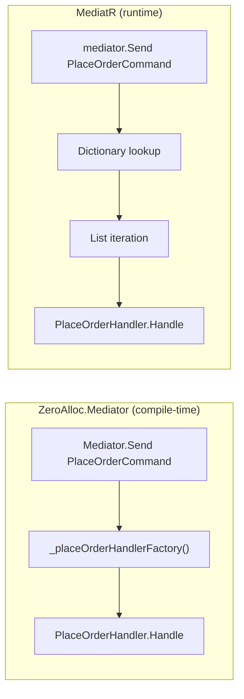

## When Zero Allocation Matters

- Background processing loops (10k+ messages/sec)
- ASP.NET Core hot paths (latency-sensitive endpoints)
- .NET Native AOT deployments (no JIT warm-up, reflection banned)
- Memory-constrained environments (IoT, embedded .NET)

## When It Doesn't Matter

If you're handling <100 req/sec, the difference between 2 ns and 100 ns is invisible. Use whatever mediator is easiest for your team.

## Native AOT

ZeroAlloc.Mediator is fully AOT-compatible. No reflection at runtime. Set `PublishAot=true` in your `.csproj` and it just works:

```xml
<PropertyGroup>
    <PublishAot>true</PublishAot>
</PropertyGroup>
```

## Tips for Maximum Performance

1. Use `readonly record struct` for all request/notification types
2. Use `ValueTask.FromResult(value)` instead of `Task.FromResult` in sync handlers
3. Use the static `Mediator` class on hot paths (not `IMediator` interface) to avoid virtual dispatch
4. Keep pipeline behaviors `static` — they have no instance state and allocate nothing
```

**Step 2: Verify**

- [ ] Explains 4 architectural decisions
- [ ] Benchmark table included
- [ ] Mermaid comparison diagram
- [ ] Native AOT section

**Step 3: Commit**

```bash
git add docs/08-performance.md
git commit -m "docs: add performance guide"
```

---

### Task 9: `docs/cookbook/01-cqrs-web-api.md`

**Files:**
- Create: `docs/cookbook/01-cqrs-web-api.md`

**Step 1: Write the file**

Content outline:

```
# Cookbook: CQRS with ASP.NET Core Minimal API

Full working example of an e-commerce product catalog endpoint set using the CQRS pattern.

## Scenario

A product catalog service with:
- `POST /products` — create product (command)
- `GET /products/{id}` — get product by ID (query)
- `GET /products` — list products with filtering (query)
- `DELETE /products/{id}` — archive product (command)

## Project Setup

```bash
dotnet new web -n ProductCatalog
cd ProductCatalog
dotnet add package ZeroAlloc.Mediator
```

## Request Types

```csharp
// Commands
public readonly record struct CreateProductCommand(
    string Name, string Sku, decimal Price, int StockLevel
) : IRequest<ProductId>;

public readonly record struct ArchiveProductCommand(Guid ProductId) : IRequest;

// Queries
public readonly record struct GetProductQuery(Guid ProductId) : IRequest<ProductDto>;

public readonly record struct ListProductsQuery(
    string? SkuPrefix, decimal? MaxPrice, int Page, int PageSize
) : IRequest<PagedResult<ProductDto>>;

// Result types
public readonly record struct ProductId(Guid Value);
public readonly record struct ProductDto(Guid Id, string Name, string Sku, decimal Price, int StockLevel);
public readonly record struct PagedResult<T>(IReadOnlyList<T> Items, int TotalCount, int Page, int PageSize);
```

## Handlers

Show all 4 handlers with realistic implementations using repository pattern.

## Endpoints

```csharp
var app = builder.Build();

app.MapPost("/products", async (CreateProductRequest req, IMediator mediator, CancellationToken ct) =>
{
    var id = await mediator.Send(new CreateProductCommand(req.Name, req.Sku, req.Price, req.StockLevel), ct);
    return Results.Created($"/products/{id.Value}", id);
});

app.MapGet("/products/{id:guid}", async (Guid id, IMediator mediator, CancellationToken ct) =>
{
    try
    {
        var dto = await mediator.Send(new GetProductQuery(id), ct);
        return Results.Ok(dto);
    }
    catch (ProductNotFoundException)
    {
        return Results.NotFound();
    }
});

app.MapGet("/products", async ([AsParameters] ListProductsRequest req, IMediator mediator, CancellationToken ct) =>
{
    var result = await mediator.Send(
        new ListProductsQuery(req.SkuPrefix, req.MaxPrice, req.Page ?? 1, req.PageSize ?? 20), ct);
    return Results.Ok(result);
});

app.MapDelete("/products/{id:guid}", async (Guid id, IMediator mediator, CancellationToken ct) =>
{
    await mediator.Send(new ArchiveProductCommand(id), ct);
    return Results.NoContent();
});
```

## Mermaid diagram

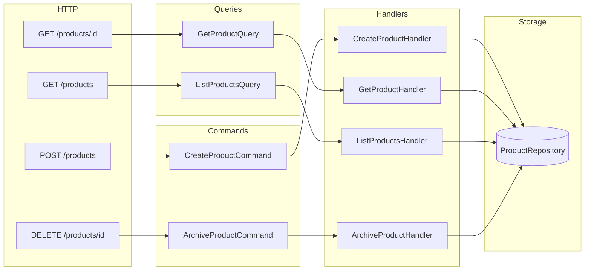

## DI Registration

Full `Program.cs` with handler registration and `Mediator.Configure()` call.
```

**Step 2: Verify**

- [ ] Full working endpoint set
- [ ] Mermaid architecture diagram
- [ ] Shows both commands and queries

**Step 3: Commit**

```bash
git add docs/cookbook/01-cqrs-web-api.md
git commit -m "docs: add CQRS web API cookbook"
```

---

### Task 10: `docs/cookbook/02-event-driven.md`

**Files:**
- Create: `docs/cookbook/02-event-driven.md`

**Step 1: Write the file**

Content outline:

```
# Cookbook: Event-Driven Architecture

Using notifications to decouple domain logic from side effects.

## Scenario

Order lifecycle: place order → payment → fulfillment → shipping. Each step publishes a domain event. Other parts of the system react independently.

## Domain Events

```csharp
public interface IOrderEvent : INotification { Guid OrderId { get; } }

public readonly record struct OrderPlacedEvent(
    Guid OrderId, string CustomerId, decimal Total
) : IOrderEvent;

[ParallelNotification]
public readonly record struct PaymentConfirmedEvent(
    Guid OrderId, decimal Amount, string TransactionId
) : IOrderEvent;

public readonly record struct OrderShippedEvent(
    Guid OrderId, string TrackingNumber, string Carrier
) : IOrderEvent;

public readonly record struct OrderCancelledEvent(
    Guid OrderId, string Reason, string CancelledBy
) : IOrderEvent;
```

## Handlers

Show:
- `OrderPlacedEvent`: reserve inventory (sequential, must complete before next step)
- `PaymentConfirmedEvent`: send receipt email + start fulfillment + update ledger (parallel, all independent)
- `OrderShippedEvent`: send shipping notification + close fulfillment record
- `IOrderEvent` (polymorphic): audit logger capturing all order events

Full handler code for each.

## Publishing Events from a Handler

Show the pattern of a command handler that publishes an event:

```csharp
public class PlaceOrderHandler : IRequestHandler<PlaceOrderCommand, OrderId>
{
    public async ValueTask<OrderId> Handle(PlaceOrderCommand cmd, CancellationToken ct)
    {
        var order = await _repo.CreateAsync(cmd, ct);
        await Mediator.Publish(new OrderPlacedEvent(order.Id, cmd.CustomerId, order.Total), ct);
        return new OrderId(order.Id);
    }
}
```

## Mermaid diagram — event flow

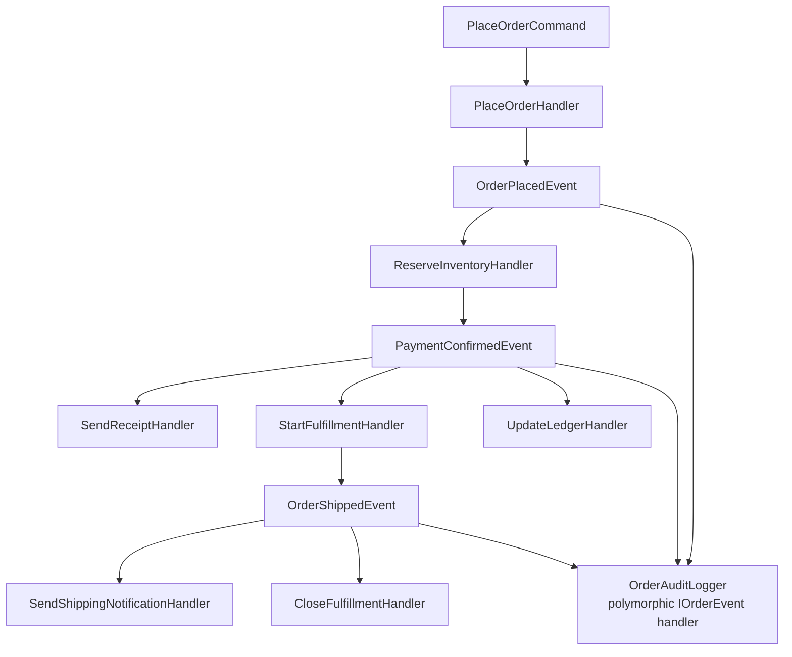

## Audit Trail with Polymorphic Handler

Show the `IOrderEvent` audit handler that captures everything into an append-only store.

## Common Mistakes

- Publishing inside a transaction: consider whether side effects should be in the same transaction or outside
- Parallel handlers that mutate shared state: use sequential for that
```

**Step 2: Verify**

- [ ] Mermaid event flow diagram
- [ ] Shows mix of sequential + parallel
- [ ] Polymorphic audit handler
- [ ] Publishes event from inside handler

**Step 3: Commit**

```bash
git add docs/cookbook/02-event-driven.md
git commit -m "docs: add event-driven cookbook"
```

---

### Task 11: `docs/cookbook/03-validation-pipeline.md`

**Files:**
- Create: `docs/cookbook/03-validation-pipeline.md`

**Step 1: Write the file**

Content outline:

```
# Cookbook: Validation with Pipeline Behaviors

Two approaches: hand-rolled `IValidatable` interface, and FluentValidation integration.

## Approach 1 — Hand-Rolled IValidatable

Define interface, implement on request structs, validate in behavior.

Full implementation with:
- `IValidatable` interface with `Validate()` method
- `ValidationBehavior` (global, Order=10)
- `ValidationException` with error list
- Two request types implementing it: `CreateProductCommand`, `PlaceOrderCommand`

## Approach 2 — FluentValidation

```bash
dotnet add package FluentValidation
```

```csharp
[PipelineBehavior(Order = 10)]
public static class FluentValidationBehavior
{
    private static readonly ConcurrentDictionary<Type, object?> _validators = new();

    public static async ValueTask<TResponse> Handle<TRequest, TResponse>(
        TRequest request,
        CancellationToken ct,
        Func<TRequest, CancellationToken, ValueTask<TResponse>> next)
    {
        var validator = (IValidator<TRequest>?)_validators.GetOrAdd(
            typeof(TRequest),
            t => FindValidator<TRequest>());

        if (validator is not null)
        {
            var result = await validator.ValidateAsync(request, ct);
            if (!result.IsValid)
                throw new ValidationException(result.Errors);
        }

        return await next(request, ct);
    }

    private static IValidator<TRequest>? FindValidator<TRequest>() =>
        // Resolve from DI or return null
        null;
}
```

Show a validator:

```csharp
public class CreateProductCommandValidator : AbstractValidator<CreateProductCommand>
{
    public CreateProductCommandValidator()
    {
        RuleFor(x => x.Name).NotEmpty().MaximumLength(200);
        RuleFor(x => x.Sku).NotEmpty().Matches(@"^[A-Z]{3}-\d{3}$");
        RuleFor(x => x.Price).GreaterThan(0);
        RuleFor(x => x.StockLevel).GreaterThanOrEqualTo(0);
    }
}
```

## Mermaid diagram

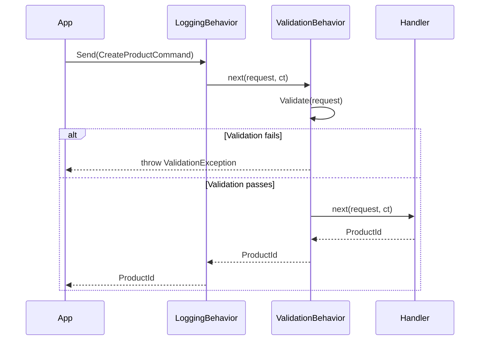

## Error Handling in the API Layer

Show catching `ValidationException` in a Minimal API endpoint and returning `Results.ValidationProblem`.
```

**Step 2: Verify**

- [ ] Two approaches covered
- [ ] Mermaid sequence diagram showing validation failure path
- [ ] FluentValidation integration
- [ ] API error handling

**Step 3: Commit**

```bash
git add docs/cookbook/03-validation-pipeline.md
git commit -m "docs: add validation pipeline cookbook"
```

---

### Task 12: `docs/cookbook/04-transactional-pipeline.md`

**Files:**
- Create: `docs/cookbook/04-transactional-pipeline.md`

**Step 1: Write the file**

Content outline:

```
# Cookbook: Transactional Pipeline with EF Core

Wrap command handlers in a database transaction automatically using a scoped pipeline behavior.

## Scenario

All commands that modify state should run in a transaction. Queries are read-only and don't need one.

## Transaction Marker Interface

```csharp
public interface ITransactionalRequest { }

public readonly record struct PlaceOrderCommand(...) : IRequest<OrderId>, ITransactionalRequest;
public readonly record struct CreateProductCommand(...) : IRequest<ProductId>, ITransactionalRequest;
// Queries do NOT implement ITransactionalRequest
public readonly record struct GetProductQuery(...) : IRequest<ProductDto>;
```

## Transaction Behavior

```csharp
[PipelineBehavior(Order = 5)]
public static class TransactionBehavior
{
    public static async ValueTask<TResponse> Handle<TRequest, TResponse>(
        TRequest request,
        CancellationToken ct,
        Func<TRequest, CancellationToken, ValueTask<TResponse>> next)
    {
        if (request is not ITransactionalRequest)
            return await next(request, ct);

        var db = GetDbContext(); // resolve from DI (show how)
        await using var tx = await db.Database.BeginTransactionAsync(ct);
        try
        {
            var response = await next(request, ct);
            await tx.CommitAsync(ct);
            return response;
        }
        catch
        {
            await tx.RollbackAsync(ct);
            throw;
        }
    }
}
```

## Challenge: Accessing Scoped DbContext from a Static Behavior

Explain the problem: static behaviors have no instance state. Solution: use a `static AsyncLocal<IServiceScope>` or resolve via `IHttpContextAccessor` / an ambient scope helper.

Show a clean ambient-scope pattern:

```csharp
public static class AmbientScope
{
    private static readonly AsyncLocal<IServiceProvider?> _scope = new();

    public static IServiceProvider? Current
    {
        get => _scope.Value;
        set => _scope.Value = value;
    }
}
```

And wiring it up in middleware:

```csharp
app.Use(async (ctx, next) =>
{
    AmbientScope.Current = ctx.RequestServices;
    await next();
});
```

## Mermaid diagram

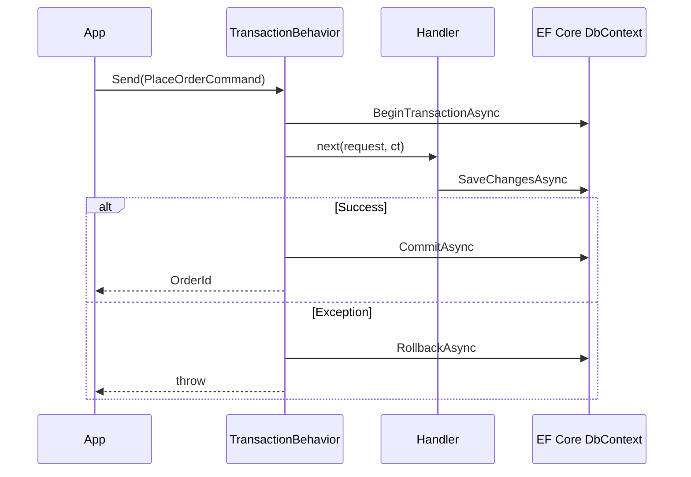

## Integration with Outbox Pattern

Brief note: publish domain events AFTER commit (not inside the handler) to avoid publishing events that get rolled back.
```

**Step 2: Verify**

- [ ] Mermaid transaction sequence diagram
- [ ] Marker interface for scoping
- [ ] Ambient scope pattern for accessing DI from static behavior
- [ ] Outbox mention

**Step 3: Commit**

```bash
git add docs/cookbook/04-transactional-pipeline.md
git commit -m "docs: add transactional pipeline cookbook"
```

---

### Task 13: `docs/cookbook/05-streaming-pagination.md`

**Files:**
- Create: `docs/cookbook/05-streaming-pagination.md`

**Step 1: Write the file**

Content outline:

```
# Cookbook: Streaming Large Datasets

Server-side streaming for bulk exports, reports, and paginated feeds.

## Scenario 1 — CSV Export Endpoint

Export all orders in a date range as a CSV download without loading them all into memory.

```csharp
public readonly record struct ExportOrdersCsvQuery(
    DateTimeOffset From,
    DateTimeOffset To,
    string? CustomerId
) : IStreamRequest<OrderCsvRow>;

public readonly record struct OrderCsvRow(
    string OrderId, string CustomerId, string Status,
    decimal Total, string PlacedAt);

public class ExportOrdersCsvHandler : IStreamRequestHandler<ExportOrdersCsvQuery, OrderCsvRow>
{
    private readonly IOrderRepository _repo;
    public ExportOrdersCsvHandler(IOrderRepository repo) => _repo = repo;

    public async IAsyncEnumerable<OrderCsvRow> Handle(
        ExportOrdersCsvQuery query,
        [EnumeratorCancellation] CancellationToken ct)
    {
        await foreach (var order in _repo.StreamAsync(query.From, query.To, query.CustomerId, ct))
        {
            yield return new OrderCsvRow(
                order.Id.ToString(), order.CustomerId, order.Status.ToString(),
                order.Total, order.PlacedAt.ToString("O"));
        }
    }
}
```

ASP.NET Core endpoint with `PushStreamContent`-style response:

```csharp
app.MapGet("/orders/export", async (
    [AsParameters] ExportOrdersRequest req,
    IMediator mediator,
    HttpResponse response,
    CancellationToken ct) =>
{
    response.ContentType = "text/csv";
    response.Headers.ContentDisposition = "attachment; filename=\"orders.csv\"";

    await using var writer = new StreamWriter(response.Body);
    await writer.WriteLineAsync("OrderId,CustomerId,Status,Total,PlacedAt");

    await foreach (var row in mediator.CreateStream(
        new ExportOrdersCsvQuery(req.From, req.To, req.CustomerId), ct))
    {
        await writer.WriteLineAsync(
            $"{row.OrderId},{row.CustomerId},{row.Status},{row.Total},{row.PlacedAt}");
    }
});
```

## Scenario 2 — Cursor-Based Pagination

Return rows in pages via a stream request that yields `Page<T>` objects.

```csharp
public readonly record struct ListProductsStreamQuery(
    string? Category, int PageSize = 50
) : IStreamRequest<ProductPage>;

public readonly record struct ProductPage(
    IReadOnlyList<ProductDto> Items, string? NextCursor);

public class ListProductsStreamHandler
    : IStreamRequestHandler<ListProductsStreamQuery, ProductPage>
{
    public async IAsyncEnumerable<ProductPage> Handle(
        ListProductsStreamQuery query,
        [EnumeratorCancellation] CancellationToken ct)
    {
        string? cursor = null;
        do
        {
            var page = await _repo.GetPageAsync(query.Category, cursor, query.PageSize, ct);
            yield return new ProductPage(page.Items, page.NextCursor);
            cursor = page.NextCursor;
        } while (cursor is not null && !ct.IsCancellationRequested);
    }
}
```

## Mermaid diagram

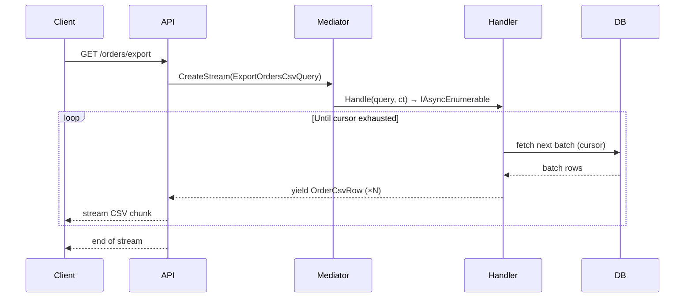

## Back-Pressure & Cancellation

Note: `ct.IsCancellationRequested` in the loop ensures the client disconnecting stops the DB reads. ASP.NET Core wires `HttpContext.RequestAborted` to the `CancellationToken` automatically.
```

**Step 2: Verify**

- [ ] Two scenarios (export + pagination)
- [ ] Mermaid diagram
- [ ] ASP.NET Core streaming response
- [ ] Cancellation note

**Step 3: Commit**

```bash
git add docs/cookbook/05-streaming-pagination.md
git commit -m "docs: add streaming pagination cookbook"
```

---

### Task 14: `docs/cookbook/06-testing-handlers.md`

**Files:**
- Create: `docs/cookbook/06-testing-handlers.md`

**Step 1: Write the file**

Content outline:

```
# Cookbook: Testing Handlers and Behaviors

Handlers are plain classes with no framework coupling — test them directly, not through `Mediator.Send`.

## Unit Testing a Request Handler

```csharp
// xUnit
public class CreateProductHandlerTests
{
    [Fact]
    public async Task Handle_ValidCommand_SavesProductAndReturnsId()
    {
        // Arrange
        var repo = new FakeProductRepository();
        var handler = new CreateProductHandler(repo);
        var command = new CreateProductCommand("Widget", "WGT-001", 9.99m, 100);

        // Act
        var result = await handler.Handle(command, CancellationToken.None);

        // Assert
        Assert.NotEqual(Guid.Empty, result.Value);
        Assert.Single(repo.Products);
        Assert.Equal("Widget", repo.Products[0].Name);
    }

    [Fact]
    public async Task Handle_InvalidSku_ThrowsArgumentException()
    {
        var repo = new FakeProductRepository();
        var handler = new CreateProductHandler(repo);
        var command = new CreateProductCommand("Widget", "", 9.99m, 100);

        await Assert.ThrowsAsync<ArgumentException>(() =>
            handler.Handle(command, CancellationToken.None).AsTask());
    }
}
```

## Fake Repository Pattern

```csharp
public class FakeProductRepository : IProductRepository
{
    public List<Product> Products { get; } = [];

    public Task SaveAsync(Product product, CancellationToken ct)
    {
        Products.Add(product);
        return Task.CompletedTask;
    }

    public Task<Product?> FindAsync(Guid id, CancellationToken ct)
        => Task.FromResult(Products.FirstOrDefault(p => p.Id == id));
}
```

## Unit Testing a Notification Handler

```csharp
public class SendShipmentEmailHandlerTests
{
    [Fact]
    public async Task Handle_OrderShippedEvent_SendsEmailWithTrackingNumber()
    {
        // Arrange
        var emailService = new FakeEmailService();
        var handler = new SendShipmentEmailHandler(emailService);
        var evt = new OrderShippedEvent(Guid.NewGuid(), "1Z999AA10123456784", DateTimeOffset.UtcNow);

        // Act
        await handler.Handle(evt, CancellationToken.None);

        // Assert
        Assert.Single(emailService.SentEmails);
        Assert.Contains("1Z999AA10123456784", emailService.SentEmails[0].Body);
    }
}
```

## Unit Testing a Pipeline Behavior

```csharp
public class LoggingBehaviorTests
{
    [Fact]
    public async Task Handle_CallsNext_ReturnsResult()
    {
        // Arrange
        var logs = new List<string>();
        var request = new CreateProductCommand("Widget", "WGT-001", 9.99m, 50);
        var expectedId = new ProductId(Guid.NewGuid());

        Func<CreateProductCommand, CancellationToken, ValueTask<ProductId>> next =
            (_, _) => ValueTask.FromResult(expectedId);

        // Act
        var result = await LoggingBehavior.Handle(request, CancellationToken.None, next);

        // Assert
        Assert.Equal(expectedId, result);
    }

    [Fact]
    public async Task Handle_HandlerThrows_ExceptionPropagates()
    {
        var request = new CreateProductCommand("Widget", "WGT-001", 9.99m, 50);

        Func<CreateProductCommand, CancellationToken, ValueTask<ProductId>> next =
            (_, _) => throw new InvalidOperationException("boom");

        await Assert.ThrowsAsync<InvalidOperationException>(() =>
            LoggingBehavior.Handle(request, CancellationToken.None, next).AsTask());
    }
}
```

## Integration Testing with Mediator.Configure

When you need to test the full pipeline (not just handlers in isolation):

```csharp
public class PlaceOrderIntegrationTests : IDisposable
{
    private readonly FakeOrderRepository _repo = new();

    public PlaceOrderIntegrationTests()
    {
        Mediator.Configure(config =>
            config.SetFactory(() => new PlaceOrderHandler(_repo)));
    }

    [Fact]
    public async Task PlaceOrder_ValidCommand_CreatesOrder()
    {
        var command = new PlaceOrderCommand("customer-1", [
            new OrderLineItem("SKU-001", 2, 29.99m)
        ]);

        var orderId = await Mediator.Send(command);

        Assert.NotEqual(Guid.Empty, orderId.Value);
        Assert.Single(_repo.Orders);
    }

    public void Dispose()
    {
        // Reset factories between tests to avoid test pollution
        Mediator.Configure(config => config.SetFactory<PlaceOrderHandler>(null!));
    }
}
```

## Testing Streaming Handlers

```csharp
[Fact]
public async Task Handle_DateRange_YieldsMatchingOrders()
{
    var repo = new FakeOrderRepository();
    repo.Add(new Order { PlacedAt = DateTimeOffset.UtcNow.AddDays(-1), ... });
    repo.Add(new Order { PlacedAt = DateTimeOffset.UtcNow.AddDays(-10), ... }); // outside range

    var handler = new ExportOrdersHandler(repo);
    var query = new ExportOrdersCsvQuery(DateTimeOffset.UtcNow.AddDays(-5), DateTimeOffset.UtcNow, null);

    var rows = new List<OrderCsvRow>();
    await foreach (var row in handler.Handle(query, CancellationToken.None))
        rows.Add(row);

    Assert.Single(rows);
}
```

## Key Principle

**Test handlers directly, not through `Mediator.Send`.** The mediator dispatch is generated code — don't test it. Your business logic is in the handler. That's what needs tests.
```

**Step 2: Verify**

- [ ] Tests for request handler, notification handler, pipeline behavior
- [ ] Integration test with `Mediator.Configure`
- [ ] Streaming handler test
- [ ] Fake repository pattern shown
- [ ] "Key Principle" callout

**Step 3: Commit**

```bash
git add docs/cookbook/06-testing-handlers.md
git commit -m "docs: add testing handlers cookbook"
```

---

### Task 15: Final — Add index and commit all

**Files:**
- Create: `docs/README.md` (index of all docs)

**Step 1: Write `docs/README.md`**

```markdown
# ZeroAlloc.Mediator Documentation

## Reference

| # | Guide | Description |
|---|-------|-------------|
| 1 | [Getting Started](01-getting-started.md) | Install and send your first request in 5 minutes |
| 2 | [Requests & Handlers](02-requests.md) | Commands, queries, Unit, dispatch |
| 3 | [Notifications](03-notifications.md) | Events: sequential, parallel, polymorphic |
| 4 | [Streaming](04-streaming.md) | `IAsyncEnumerable` for large results |
| 5 | [Pipeline Behaviors](05-pipeline-behaviors.md) | Middleware: logging, validation, caching |
| 6 | [Dependency Injection](06-dependency-injection.md) | DI containers, `IMediator`, factory delegates |
| 7 | [Diagnostics](07-diagnostics.md) | ZAM001–ZAM007 compiler error reference |
| 8 | [Performance](08-performance.md) | Zero-alloc internals, benchmarks, AOT |

## Cookbook

| # | Recipe | Scenario |
|---|--------|----------|
| 1 | [CQRS Web API](cookbook/01-cqrs-web-api.md) | Full ASP.NET Core Minimal API with commands & queries |
| 2 | [Event-Driven Architecture](cookbook/02-event-driven.md) | Domain events, fan-out, audit trails |
| 3 | [Validation Pipeline](cookbook/03-validation-pipeline.md) | FluentValidation or hand-rolled validation |
| 4 | [Transactional Pipeline](cookbook/04-transactional-pipeline.md) | EF Core transactions in a behavior |
| 5 | [Streaming Large Datasets](cookbook/05-streaming-pagination.md) | CSV export, cursor pagination |
| 6 | [Testing Handlers](cookbook/06-testing-handlers.md) | Unit and integration tests |
```

**Step 2: Commit all**

```bash
git add docs/README.md
git commit -m "docs: add documentation index"
```
